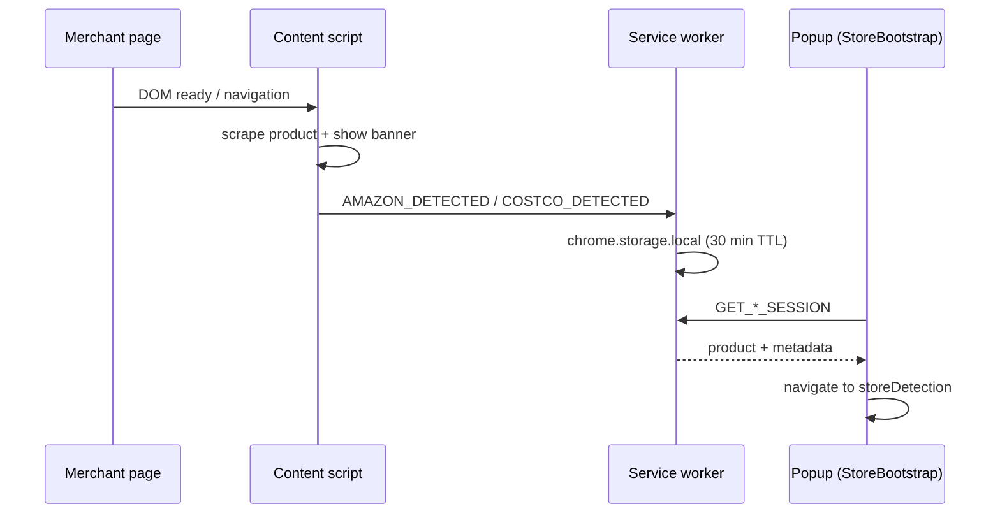

# Kueski Pay Extension — E-commerce Payment System

Browser extension that integrates **Kueski Pay** into compatible online stores. Users link their account, see available credit, get non-intrusive offer notifications on product pages, simulate installments, and complete purchases with a temporary digital card — backed by **Supabase** (PostgreSQL) with in-memory fallbacks when the database is unavailable.

## Project overview

The system combines:

- **Extension popup (9 screens)** — Account link, dashboard, store detection, offers, simulation, eligibility, digital card, confirmation, preferences (~360–400px)
- **On-page banners** — Injected on Amazon and Costco product pages via content scripts
- **Background service worker** — Persists store sessions (scraped product, URL, TTL) for popup auto-detection
- **Supabase data layer** — Users, stores, products, offers, and credit updates via `@supabase/supabase-js`

Full requirements: **[PRD.md](./PRD.md)** · Flow coverage: **[FLOWS.md](./FLOWS.md)** · Database setup: **[SUPABASE_SETUP.md](./SUPABASE_SETUP.md)**

## Main features

### Extension UI (9 screens)

| # | Screen | Highlights |
|---|--------|------------|
| 1 | **Login / Link** | Sign in with email; 6-digit verification code (demo) |
| 2 | **Dashboard** | Available credit, active promos, compatible stores, store simulation shortcuts |
| 3 | **Store detection** | Banner when visiting **Amazon** or **Costco** (content script + session) |
| 4 | **Active offer** | MSI promos, financeable amount, interest estimate, validity |
| 5 | **Simulation** | Installment calculator (optional step in financing flow) |
| 6 | **Eligibility** | Purchase qualification, available credit, payment conditions |
| 7 | **Digital card** | Temporary virtual card with reveal animation |
| 8 | **Confirmation** | Success state, transaction summary |
| 9 | **Preferences** | Notifications, alert intensity, privacy controls |

### Content scripts & checkout

- **Store banners** — Dismissible Kueski banner on compatible product pages (Amazon, Costco)
- **DOM scraping** — Product title, price, and URL extracted from merchant pages
- **Session bridge** — Content script → background worker → popup (`StoreBootstrap`)
- **Payment simulation** — Real-time installment estimates from product price and active offer
- **Checkout integration** — Mock digital card; credit updated in Supabase on confirmation
- **Multisite compatibility** — Amazon and Costco live; AliExpress and Mercado Libre listed as “próximamente”

## Target audience (personas)

1. **The Analytical Buyer (Carlos Martinez, 38):** Quick payments; abandons checkout if forms are tedious.
2. **The Flexible Buyer (Andrea Lopez, 24):** Budget management through transparent deferred payments.

## Tech stack

| Layer | Stack |
|-------|--------|
| Extension / popup | React 18, TypeScript, Tailwind CSS, Chrome Extension API (MV3), Framer Motion |
| Content scripts | TypeScript (IIFE bundles: `content.js`, `costco.js`) |
| Data | Supabase (`@supabase/supabase-js`) — PostgreSQL with client-side queries |
| Build | Vite 7 |

## Project structure

```
ExtensionKueski/
├── PRD.md
├── FLOWS.md
├── SUPABASE_SETUP.md
├── README.md
├── public/manifest.json          # Copied to dist/ on build
├── popup.html                    # Extension popup entry
├── dist/                         # Load this folder in Chrome
├── scripts/
│   ├── build-content-scripts.mjs # Bundles amazon.ts → content.js, costco.ts → costco.js
│   └── generate-icons.mjs
└── src/
    ├── App.tsx                   # Screen router + StoreBootstrap
    ├── screens/                  # Login, Dashboard, StoreDetection, …
    ├── components/
    │   ├── StoreBootstrap.tsx    # Auto-detects Amazon/Costco tab on popup open
    │   ├── layout/               # PopupShell, FlowDevPanel
    │   └── ui/
    ├── content/
    │   ├── amazon.ts             # Amazon content script entry
    │   ├── costco.ts             # Costco content script entry
    │   ├── banner.ts             # Shared on-page banner UI
    │   └── scrape.ts             # Shared DOM scraping helpers
    ├── background/
    │   └── service-worker.ts     # Session storage (30 min TTL)
    ├── extension/
    │   ├── messages.ts           # Message types + host helpers
    │   └── session.ts            # Popup ↔ background bridge
    ├── context/AppContext.tsx    # Global state + reducers
    ├── mock/data.ts              # Supabase client, queries, fallbacks
    └── types.ts
```

## Getting started

### Prerequisites

- Node.js 18+
- Google Chrome (for extension testing)
- Supabase project (optional — extension falls back to mock data if unavailable)

### Chrome extension (load from `dist/`)

```bash
npm install
npm run build
```

After build, `dist/` contains everything Chrome needs:

```
dist/
  manifest.json
  popup.html
  content.js          # Amazon content script
  costco.js           # Costco content script
  background.js
  icons/
  assets/
```

**Load in Google Chrome:**

1. Open `chrome://extensions`
2. Enable **Developer mode**
3. Click **Load unpacked**
4. Select the **`dist`** folder (not the project root)

**Test on Amazon:**

1. Open [amazon.com.mx](https://www.amazon.com.mx) on a product page
2. You should see a small **Kueski** banner (dismissible, bottom-right)
3. Click the extension icon → **Iniciar sesión** → enter the 6-digit verification code (shown in the popup for demo)
4. The popup should open on **Tienda detectada** with the scraped product
5. Continue: Oferta → (Simulación) → Elegibilidad → Tarjeta → Confirmación

**Test on Costco:**

1. Open [costco.com.mx](https://www.costco.com.mx) on a product page
2. Same banner and popup flow as Amazon; store detection UI uses Costco branding

| Flow | Steps |
|------|--------|
| **Happy path (Amazon)** | Login + 2FA → auto store detection → Oferta → Elegibilidad → Tarjeta → Confirmación |
| **Happy path (Costco)** | Login + 2FA → Costco tab → store detection → full financing flow |
| **No califica** | Dashboard → *Amazon producto $38,999* (manual fallback) → Elegibilidad denegada |

### Web preview (development)

```bash
npm run dev
```

Opens at `http://localhost:5173` for UI work without reloading the extension. A **Panel de flujos** at the bottom lets you jump between screens. Use dashboard buttons to simulate Amazon or Costco visits when not in Chrome.

### Supabase (optional)

See **[SUPABASE_SETUP.md](./SUPABASE_SETUP.md)** for table schemas and connection details. The extension reads stores, products, offers, and user credit from Supabase at load time and falls back to hardcoded defaults when queries fail.

## Architecture



- **Mutual exclusion:** Detecting Amazon clears any Costco session (and vice versa).
- **Notifications gate:** Auto-detection only runs when the user is logged in and `preferences.notificaciones` is enabled.
- **Dismissal:** Dismissing store detection resets the session key so the same visit is not re-applied.

## Database (Supabase)

Core tables used by the extension (see [SUPABASE_SETUP.md](./SUPABASE_SETUP.md) for SQL):

| Table | Purpose |
|-------|---------|
| **usuario** | User profile, email, `limite_de_credito` |
| **tienda** | Store domains, `compatibilidad_kueski`, active flag |
| **producto** | Product name, price, URL, linked to `id_tienda` |
| **oferta** | Promotions, MSI months, rates, validity (`tipo` 1 = financing, 2 = dashboard promos) |

Credit updates after checkout call `updateUserCredit()` in `src/mock/data.ts`.

## User flows

**Popup journey:** Login → Dashboard → Store detection → Offer → (Simulation) → Eligibility → Digital card → Confirmation (+ Preferences anytime)

**On-page detection:** Product page → content script scrapes DOM → background stores session → popup reads session on open

## Design principles

- **Fintech trust:** Clean layout, Kueski purple accent (`#4648e8`), strong readability
- **Utility copy:** Short status and action messages in Spanish
- **User control:** Dismiss banners and promotions; minimal friction
- **Prominent credit:** Available line and financeable amounts as visual focus

## Out of scope

- Production Kueski credit approval / real banking APIs
- Real payment card issuance (digital card is simulated)
- Full floating checkout widget on merchant pages (banners only in v1)
- Separate Node.js REST API layer (Supabase client used directly)
- Chrome Web Store production release (optional for course)

The project **does** include extension UI, Supabase persistence, and mocked credit decisioning for the academic prototype.
